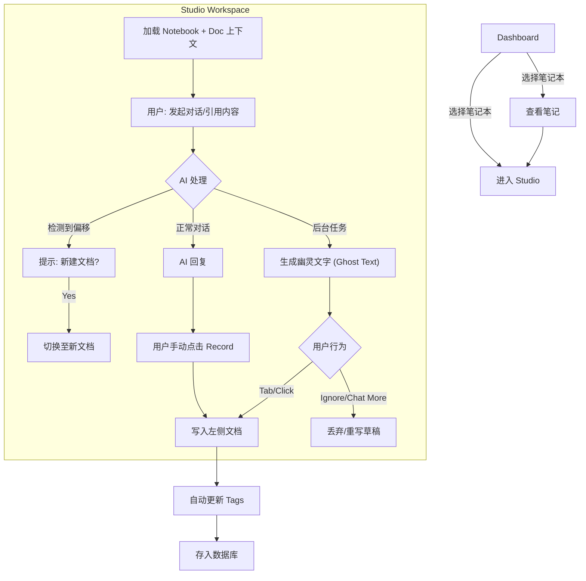

这是一份基于我们所有深度讨论、针对高级开发者视角的完整产品需求文档 (PRD)。

---

# 产品需求文档 (PRD): Co-mind

| 项目名称 | **Co-mind** |
| --- | --- |
| **版本号** | v1.0 (MVP) |
| **状态** | **Finalized** |
| **最后更新** | 2026-01-21 |
| **核心隐喻** | 创意总监 (User) + 智能助理团队 (AI) |

---

## 1. 产品概述 (Executive Summary)

### 1.1 产品定义

**Co-mind** 是一个“对话即生成”的原生 AI 知识创造工作台。它打破了传统聊天机器人（Chatbot）与笔记软件（Note-taking App）的边界，通过**双栏协作界面**与**深度上下文记忆**，帮助用户将流动的、低密度的对话流，实时编织成结构化的、高密度的知识文档。

### 1.2 核心痛点解决

1. **信噪比低**：解决聊天记录难以转化为沉淀知识的问题。
2. **上下文断裂**：解决新对话无法自动继承旧结论、手动复制粘贴繁琐的问题。
3. **心流打断**：解决在创作过程中频繁切换工具、查找资料打断思路的问题。

### 1.3 设计原则

* **Atomicity (原子化)**：One Doc = One Topic。文档是知识存储的最小单元。
* **Proactivity (主动性)**：AI 不仅响应指令，更主动感知上下文，提供“幽灵速记”和“偏移预警”。
* **Intuitiveness (直觉优先)**：拒绝机械指令，采用自然语言引用、点击确认、拖拽交互。

---

## 2. 产品架构 (Architecture)

系统分为两个核心视图：

1. **Dashboard (管理台)**：“图书馆”模式。负责知识的宏观浏览、检索与归档。
2. **Studio (工作台)**：“会议室”模式。负责具体的创作与思考。采用 **左文档 (Doc) + 右对话 (Chat)** 的双栏布局。

---

## 3. 功能需求详细说明 (Functional Requirements)

### 模块 A: 语境与记忆 (Context & Memory) - **The Foundation**

*此模块确保 AI “进门就懂你”，并能“指哪打哪”。*

| ID | 功能名称 | 详细描述 | 交互逻辑 |
| --- | --- | --- | --- |
| **C-01** | **层级化上下文初始化** | 进入 Studio 时，AI 自动加载背景知识。 | 1. 自动注入当前 **Notebook (项目)** 的元数据摘要。  2. 自动注入当前 **Document (文档)** 的全文内容。  3. UI 顶部显示 `Memory: Active`。 |
| **C-02** | **"指" (Point) 引用** | 视觉化引用屏幕上的实体。 | 1. **引用段落**：在左侧文档选中文本 -> 悬浮菜单点击 `Chat` -> 引用卡片插入输入框。  2. **引用气泡**：双击/拖拽右侧历史消息 -> 引用该消息内容。 |
| **C-03** | **"说" (Speak) 引用** | 自然语言模糊检索。 | 1. **@提及**：输入 `@` -> 弹出最近/同项目文档列表 -> 选中引用。  2. **自然语言回溯**：用户说“参考**#写作技巧**里的冲突理论” -> AI 检索 Tag 下的相关切片 -> 引用并回答。 |
| C-04 | **源头溯源 (Highlighter)** | 建立文档与对话的信任链接。 | 鼠标悬停在左侧文档的某一段落时，右侧 Chat 流中生成该段落所依据的原始对话气泡**高亮显示**。 |

### 模块 B: 智能创作循环 (Creation Loop) - **The Core**

*此模块实现“聊天变文档”的核心魔法。*

| ID | 功能名称 | 详细描述 | 交互逻辑 |
| --- | --- | --- | --- |
| **Cr-01** | **幽灵文字 (Ghost Drafting)** | **(Killer Feature)** AI 实时预测并草拟文档内容。 | 1. 当右侧对话产生有效结论时，左侧光标处出现**浅灰色流式文字**。 2. 用户按 `Tab` 键或点击：**确认上屏**（变实心黑字）。 3. 用户继续聊天：旧幽灵文字消失，生成新草稿。 |
| **Cr-02** | **Record 按钮 (手动速记)** | 强制将当前对话沉淀为文档。 | 1. 点击输入框上方的 `Record` 按钮。 2. AI 总结最近未记录的 N 轮对话 3. 以增量形式追加到左侧文档末尾。 |
| **Cr-03** | **智能偏移检测 (Smart Divergence)** | 防止单篇文档主题杂乱。 | 1. AI 后台监测用户最新输入与当前文档主题的语义距离。 2. 若判定偏移，输入框上方弹出非阻断式提示：*“检测到新话题：[Topic]。是否新建文档？”* 3. 点击 `Yes` -> 自动创建新文档并迁移上下文。 |
| **Cr-04** | **自动归档 (Auto-Tagging)** | 减轻整理负担。 | 文档生成/保存时，AI 自动分析内容并打上 3-5 个 Tags。用户可手动删除或修正。 |
| **Cr-05**  | **再次编辑 (Editing)** | 修改之前已经确定的段落或者文档  | 只有用户明确说修改才会修改 |

### 模块 C: 基础管理 (Management) - **The Skeleton**

| ID | 功能名称 | 详细描述 | 交互逻辑 |
| --- | --- | --- | --- |
| **M-01** | **笔记本系统** | 扁平化两级结构。 | 仅支持 `Notebook` -> `Document` 两级。不支持无限文件夹嵌套。 |
| **M-02** | **全局搜索** | 传统的搜索入口。 | 支持按标题、全文内容、Tag 搜索文档。 |

---

## 4. 用户交互流程 (User Journey Map)

---

## 5. 数据结构设计 (Data Schema) - For Dev

为了支撑上下文引用和回溯，采用关系型数据库 + 向量字段的设计。

* **Notebooks**
    * `id`: UUID
    * `name`: String
    * `summary_vector`: Vector (用于进场时的上下文预加载)

* **Documents**
    * `id`: UUID
    * `notebook_id`: FK
    * `title`: String
    * `content`: Markdown Text
    * `tags`: JSON Array
    * `content_vector`: Vector (用于语义检索)
    * `created_at`: Timestamp

* **Chat_Sessions** (对应 Studio 的右侧会话)
    * `id`: UUID
    * `document_id`: FK (会话默认依附于文档，形成 One Doc = One Topic)
    * `is_archived`: Boolean (当文档切换时，旧会话归档)

* **Messages**
    * `id`: UUID
    * `session_id`: FK
    * `role`: user/assistant
    * `content`: Text
    * `reference_links`: JSON (记录引用的 DocID 或 BlockID)

---

## 6. 技术栈建议 (Tech Stack Recommendation)

鉴于对交互流畅度和本地优先的需求：

* **Frontend**: React + TypeScript
    * **Editor Engine**: **TipTap** (Headless, Vue/React friendly)。
    * *关键点*：使用 TipTap 的 Decorations API 实现“幽灵文字”和“高亮溯源”。

* **State / Database**: **Local-first 架构**。
    * 推荐 **PGlite (WASM PostgreSQL)** 或 **RxDB**。
    * *理由*：所有写作和聊天操作先落本地，零延迟；后台异步同步。

* **AI Orchestration**:
    * **Dual-Stream**: 前端需维护两个 LLM 流。
    * Stream A (Chat): 响应对话。
    * Stream B (Draft): 响应文档生成（Debounce 触发）。

* **Vector Search**: 使用 **Transformers.js** 在浏览器端做轻量级 Embedding 和相似度计算（实现零延迟的偏移检测），或调用服务器端向量库。

---

## 7. MVP 范围界定 (Scope Control)

为了在 **2-4 周** 内交付，以下功能暂列为 P2 (Post-MVP)：

1. 多模态支持（图片/语音）。
2. 多人协作/分享。
3. 复杂的双向链接图谱 (Graph View)。
4. 插件系统。
5. 编辑已经归档的内容。

---

## 8. 验收标准 (Acceptance Criteria)

1. **自然感**：用户在不点击任何按钮的情况下，能够通过 Tab 键完成“对话 -> 文档”的转化。
2. **准确性**：基于笔记本 A 发起对话时，AI 能够准确引用笔记本 A 内的历史设定，无幻觉。
3. **流畅性**：右侧聊天与左侧幽灵文字生成互不阻塞，且无明显卡顿。
4. **闭环**：从新建笔记 -> 聊天 -> 生成文档 -> 归档 -> 再次检索引用，整个链路顺畅无断点。